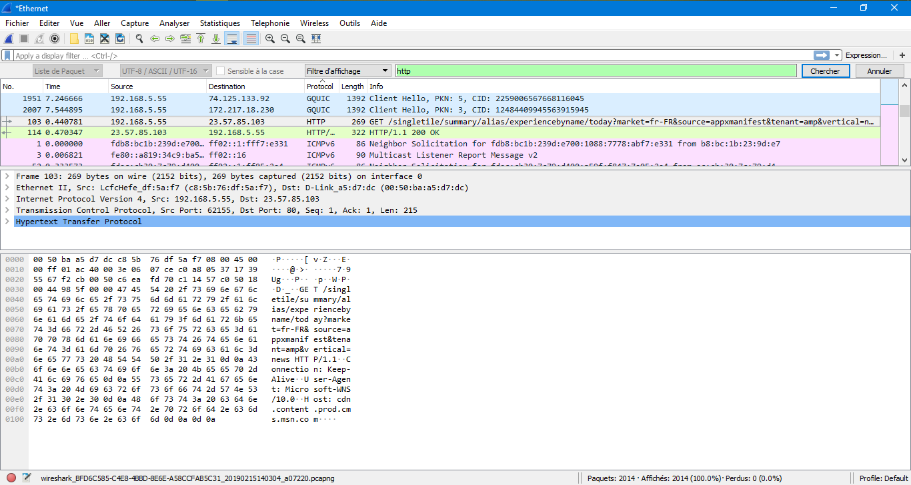

# 1- Download and install Wireshark on a computer. Start a web browser on your computer and start packet capture with Wireshark. Use your browser to go to the website of CNN. Stop packet capture with Wireshark. Using Wireshark, find the HTTP packet which was initially sent by your browser to the New York Times web server to request the page. Select that request message and submit a screen dump (print screen) of Wireshark displaying the request. Save that screen dump and upload it here. 

 
