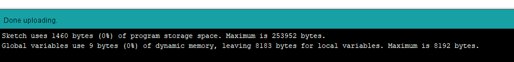

# 1-Identify and analyze a device that is an IoT device now, but in the past was a non-IoT device. Describe and list the features of the device.

**Compiling is done successfully**

# 2-Compare the functions of the device in the past to the functions of the device now.

**Uploading is done successfully**

