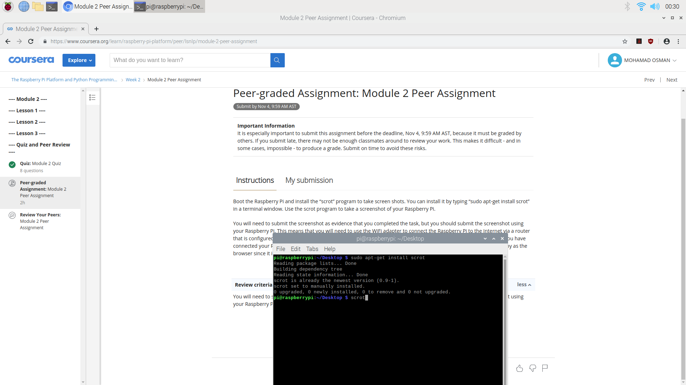

# Boot the Raspberry Pi and install the “scrot” program to take screen shots. You can install it by typing “sudo apt-get install scrot” in a terminal window. Use the scrot program to take a screenshot of your Raspberry Pi.

